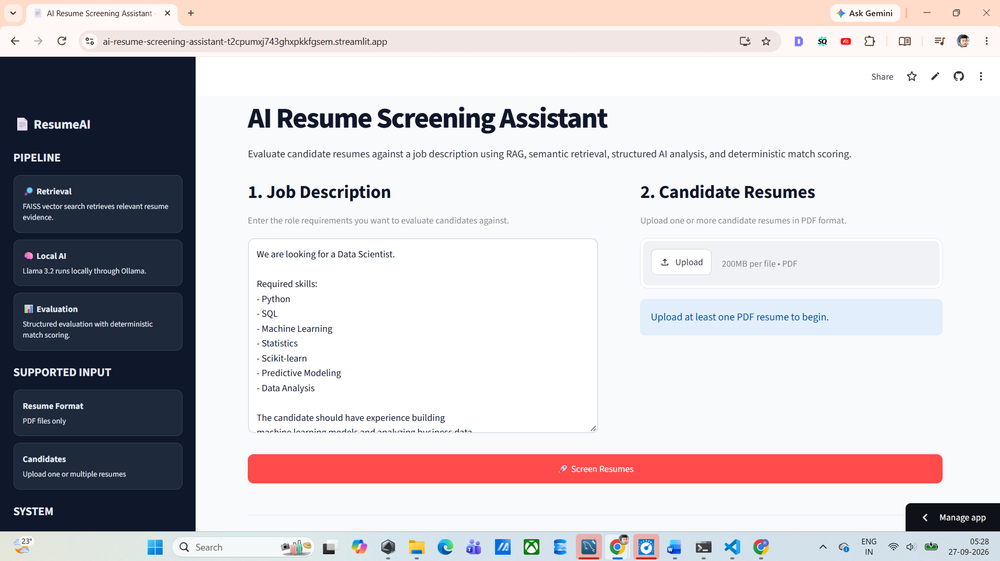
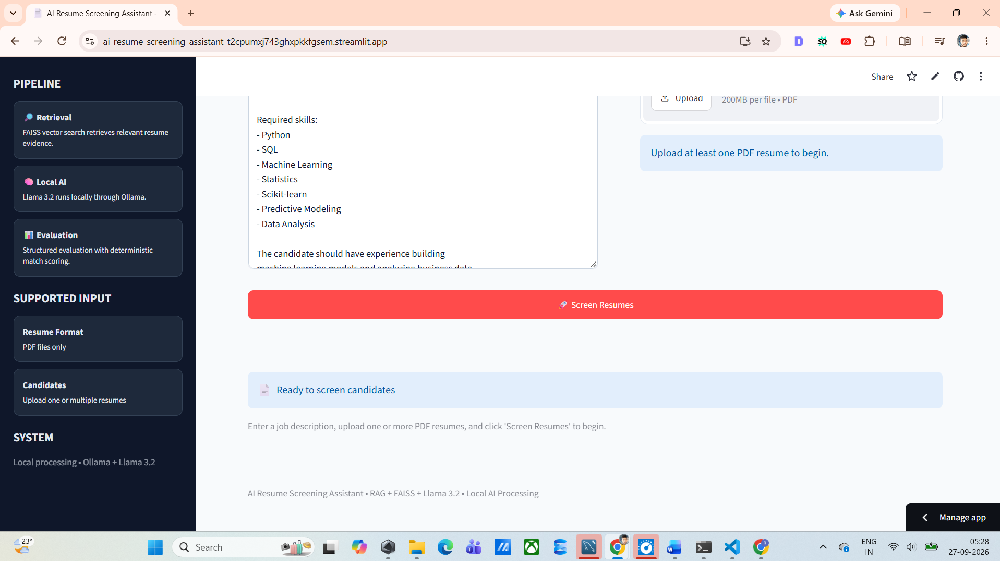
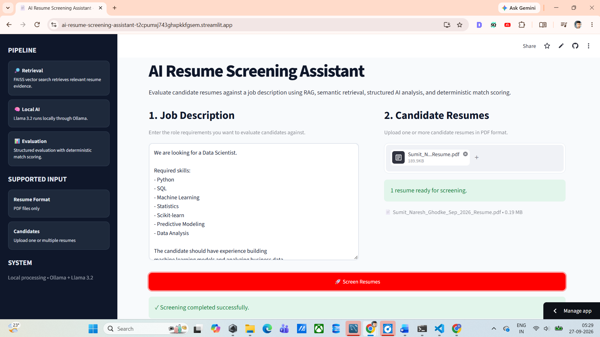
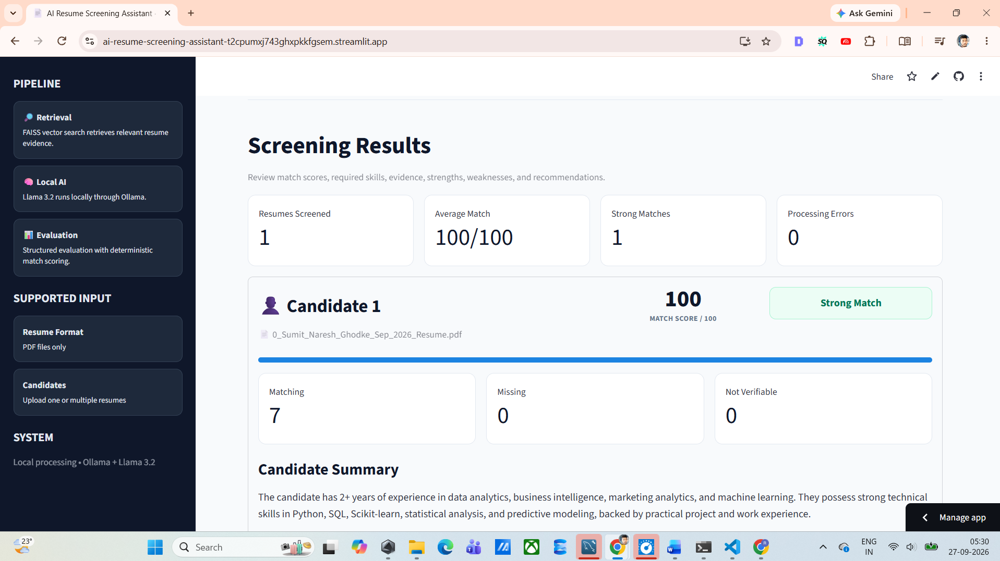
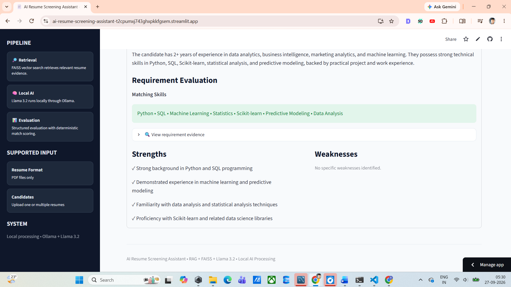
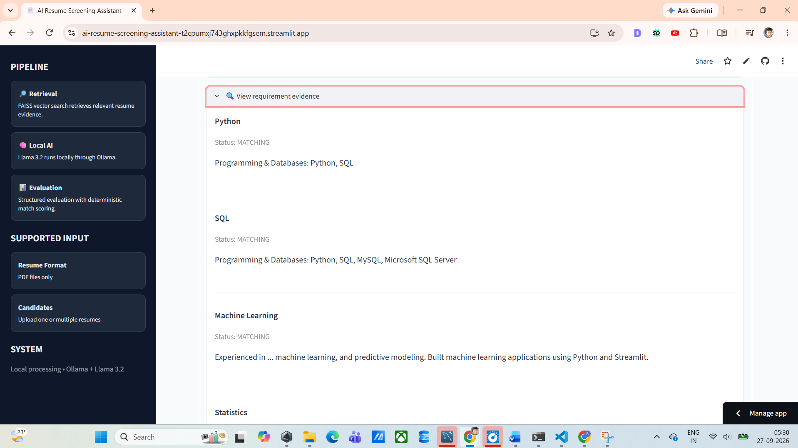

# 🤖 AI Resume Screening Assistant

### AI-Powered Resume Screening using LangChain, RAG, FAISS, Llama 3.2, Gemini & Streamlit

[](https://www.python.org/)
[](https://streamlit.io/)
[](https://www.langchain.com/)
[](https://github.com/facebookresearch/faiss)
[](https://ollama.com/)
[](https://www.llama.com/)
[](https://ai.google.dev/)
[](#license)

---

## 🌐 Live Application

### 🚀 Try the AI Resume Screening Assistant

👉 **[Launch Live Web App](https://ai-resume-screening-assistant-t2cpumxj743ghxpkfgsem.streamlit.app/)**

The application is built with **Streamlit** and provides an interactive interface for uploading resumes and evaluating candidates against a Job Description.

> **Note:** The application supports a local LLM workflow using Ollama and can also use a cloud LLM configuration for deployment environments where Ollama is not available.

---
# 📸 Application Screenshots

Explore the different stages of the **AI Resume Screening Assistant** through the screenshots below.

---

## 🏠 1. Application Home Page

The home page provides the main interface for entering a Job Description and uploading candidate resumes.



---

## 📝 2. Job Description Input

Users can enter the complete Job Description containing the skills, qualifications, and requirements that should be evaluated against the uploaded resumes.



---

## 📄 3. Resume Upload

The application supports uploading one or more candidate resume PDF files for screening.



---

## 🔍 4. Resume Screening Results

After screening, the application displays the candidate evaluation, including the calculated match score and relevant matching information.



---

## 📊 5. Requirement-Level Evidence

The requirement evidence section shows how individual Job Description requirements are evaluated against information retrieved from the candidate's resume.



---

## 👤 6. Candidate Evaluation

The final evaluation provides a structured overview of the candidate, including summary, strengths, weaknesses, matching skills, missing requirements, and recommendation.



---

# 🖼️ Screenshot Gallery

| Application | Screenshot |
|---|---|
| 🏠 Home Page |  |
| 📝 Job Description |  |
| 📄 Resume Upload |  |
| 🔍 Screening Results |  |
| 📊 Requirement Evidence |  |
| 👤 Candidate Evaluation |  |

---

## 🔄 Complete Application Flow

```text
┌──────────────────────────────┐
│      🏠 Application Home     │
└──────────────┬───────────────┘
               │
               ▼
┌──────────────────────────────┐
│   📝 Enter Job Description   │
└──────────────┬───────────────┘
               │
               ▼
┌──────────────────────────────┐
│      📄 Upload Resumes       │
└──────────────┬───────────────┘
               │
               ▼
┌──────────────────────────────┐
│     🔍 Screen Candidates     │
└──────────────┬───────────────┘
               │
               ▼
┌──────────────────────────────┐
│      📊 Match Evaluation     │
└──────────────┬───────────────┘
               │
               ▼
┌──────────────────────────────┐
│   📋 Requirement Evidence    │
└──────────────┬───────────────┘
               │
               ▼
┌──────────────────────────────┐
│    👤 Candidate Summary      │
│    💪 Strengths              │
│    ⚠️ Weaknesses             │
│    🎯 Recommendation         │
└──────────────────────────────┘


# 📌 Table of Contents

- [Project Overview](#-project-overview)
- [Problem Statement](#-problem-statement)
- [Project Objective](#-project-objective)
- [What Does This Application Do?](#-what-does-this-application-do)
- [Key Features](#-key-features)
- [Application Screenshots](#-application-screenshots)
- [How the Application Works](#-how-the-application-works)
- [RAG Architecture](#-rag-architecture)
- [Complete AI Workflow](#-complete-ai-workflow)
- [Technology Stack](#-technology-stack)
- [Frameworks and Libraries](#-frameworks-and-libraries)
- [Core Components](#-core-components)
- [PDF Processing](#-pdf-processing)
- [Text Splitting](#-text-splitting)
- [Embedding Generation](#-embedding-generation)
- [FAISS Vector Database](#-faiss-vector-database)
- [Semantic Retrieval](#-semantic-retrieval)
- [Prompt Engineering](#-prompt-engineering)
- [Structured AI Output](#-structured-ai-output)
- [Match Score Calculation](#-match-score-calculation)
- [Candidate Evaluation](#-candidate-evaluation)
- [Application Interface](#-application-interface)
- [Example Job Description](#-example-job-description)
- [Example Evaluation Output](#-example-evaluation-output)
- [Benefits](#-benefits)
- [Why RAG?](#-why-rag)
- [Local AI Architecture](#-local-ai-architecture)
- [Cloud Deployment Architecture](#-cloud-deployment-architecture)
- [Local vs Cloud](#-local-vs-cloud)
- [Project Structure](#-project-structure)
- [Installation](#-installation)
- [Environment Setup](#-environment-setup)
- [Running the Application](#-running-the-application)
- [Streamlit Cloud Deployment](#-streamlit-cloud-deployment)
- [Security and API Keys](#-security-and-api-keys)
- [Testing](#-testing)
- [Test Cases](#-test-cases)
- [Performance Considerations](#-performance-considerations)
- [Limitations](#-limitations)
- [Future Improvements](#-future-improvements)
- [Responsible AI Considerations](#-responsible-ai-considerations)
- [Skills Demonstrated](#-skills-demonstrated)
- [Learning Outcomes](#-learning-outcomes)
- [Interview Talking Points](#-interview-talking-points)
- [Project Highlights](#-project-highlights)
- [Author](#-author)
- [Connect With Me](#-connect-with-me)
- [License](#-license)

---

# 🚀 Project Overview

The **AI Resume Screening Assistant** is an AI-powered web application designed to evaluate resumes against a given **Job Description (JD)**.

The application uses:

- **LangChain**
- **Retrieval-Augmented Generation (RAG)**
- **FAISS Vector Database**
- **Sentence Transformers**
- **Hugging Face Embeddings**
- **Llama 3.2**
- **Ollama**
- **Google Gemini**
- **Pydantic**
- **PyPDF**
- **Streamlit**

The system allows a user to upload one or more resume PDFs, enter a Job Description, and receive structured candidate evaluations.

The evaluation includes:

- Match Score
- Matching Skills
- Missing Skills
- Candidate Summary
- Strengths
- Weaknesses
- Requirement-by-Requirement Evidence
- Hiring Recommendation

The system is designed around **RAG-based document retrieval**, allowing the language model to generate evaluations using information retrieved from the uploaded resume documents.

---

# 🎯 Problem Statement

Recruiters and hiring teams may need to review many resumes for a single position.

Traditional manual resume screening can require significant time to:

1. Read resumes
2. Identify relevant skills
3. Compare candidate experience with the Job Description
4. Identify missing requirements
5. Summarize candidate qualifications
6. Compare multiple candidates

This project demonstrates how **Retrieval-Augmented Generation (RAG)** and **Large Language Models (LLMs)** can be used to create an AI-assisted resume screening workflow.

Instead of sending the entire document directly to the LLM, the application first processes the resume, creates embeddings, stores them in a vector database, retrieves relevant sections, and then provides those retrieved sections as context for evaluation.

---

# 🎯 Project Objective

The primary objective is to build an AI-powered Resume Screening Assistant that can:

- Accept one or more PDF resumes
- Accept a Job Description
- Extract resume content
- Split the document into smaller chunks
- Generate semantic embeddings
- Store embeddings in FAISS
- Retrieve relevant resume information
- Compare resume evidence with job requirements
- Generate structured candidate evaluations
- Calculate a deterministic match score
- Provide missing and matching skills
- Generate strengths and weaknesses
- Provide a hiring recommendation
- Display results through a Streamlit interface

---

# 🧠 What Does This Application Do?

The application follows this workflow:

```text
User
 │
 ├── Upload Resume PDF(s)
 │
 └── Enter Job Description
          │
          ▼
   PDF Text Extraction
          │
          ▼
     Text Splitting
          │
          ▼
    Embedding Generation
          │
          ▼
      FAISS Vector DB
          │
          ▼
      Semantic Retrieval
          │
          ▼
      Relevant Context
          │
          ▼
      Prompt Template
          │
          ▼
        LLM
   ┌──────┴─────────┐
   │                │
Llama 3.2         Gemini
(Ollama)          (Cloud)
   │                │
   └──────┬─────────┘
          ▼
 Structured Evaluation
          │
          ▼
 Match Score + Skills
 + Summary + Strengths
 + Weaknesses + Recommendation
          │
          ▼
      Streamlit UI
